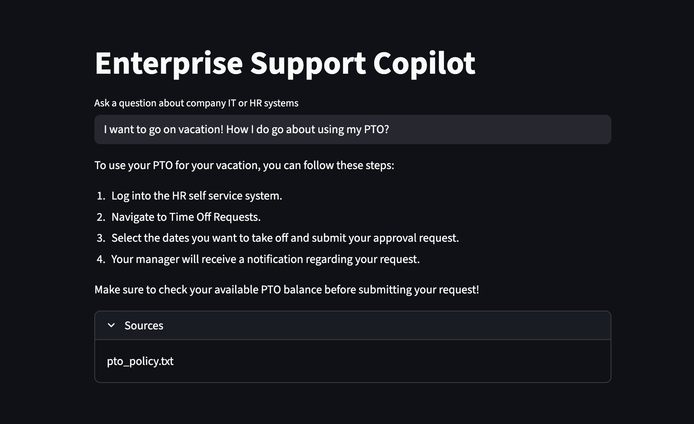
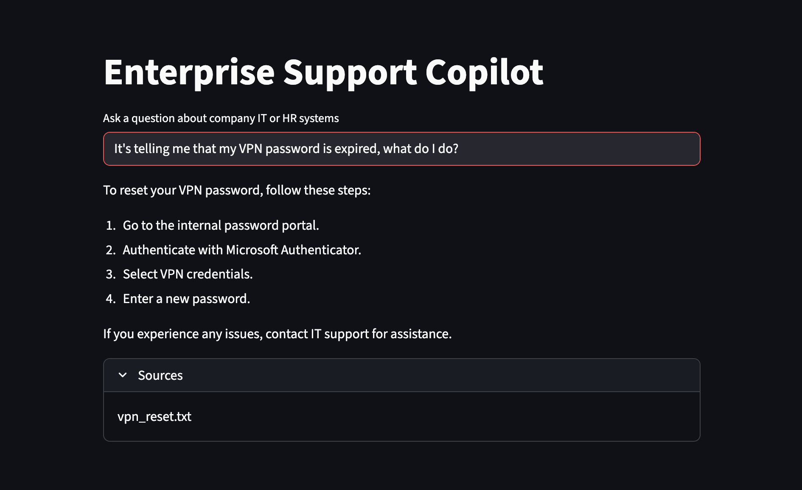
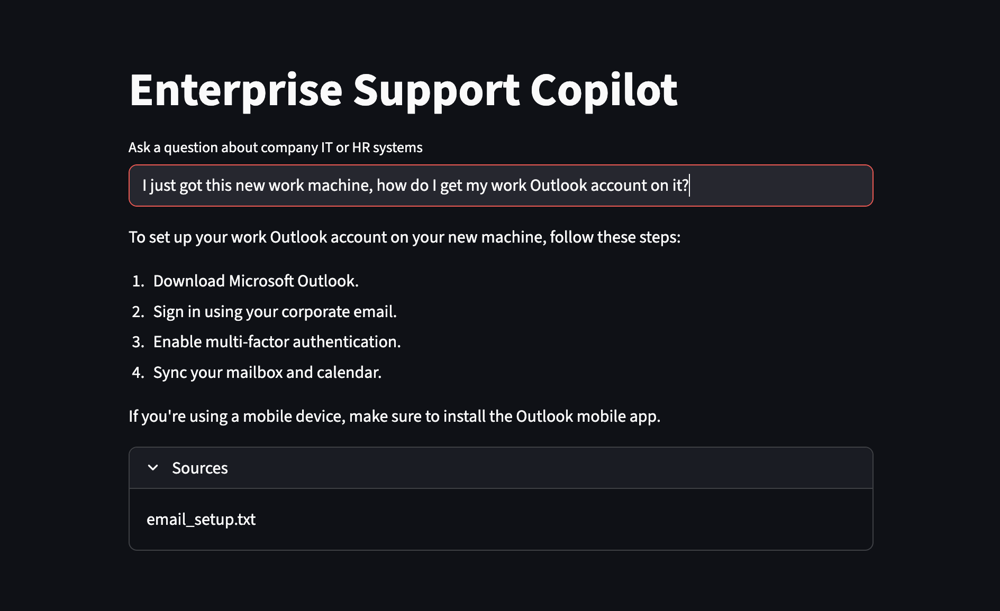
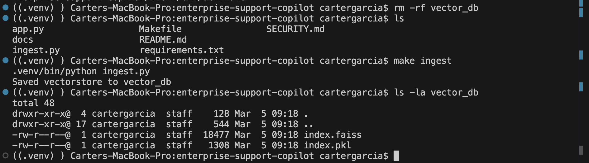

# Enterprise Support Copilot (RAG)

An employee self service style Copilot that answers IT and HR questions using retrieval augmented generation (RAG).

Provide internal style documentation in `./docs`. This project embeds those docs into a local FAISS vector store and uses an LLM to answer questions grounded in retrieved context.

## Demo

Grounded answers with sources from the underlying knowledge base documents.

### PTO request workflow


### VPN password reset


### Outlook setup on a new device


## Reproducible setup

Build the local FAISS vector store from docs:



## Setup

### 1) Create a virtual environment and install dependencies
Using Make (recommended):

```bash
make setup


License: MIT